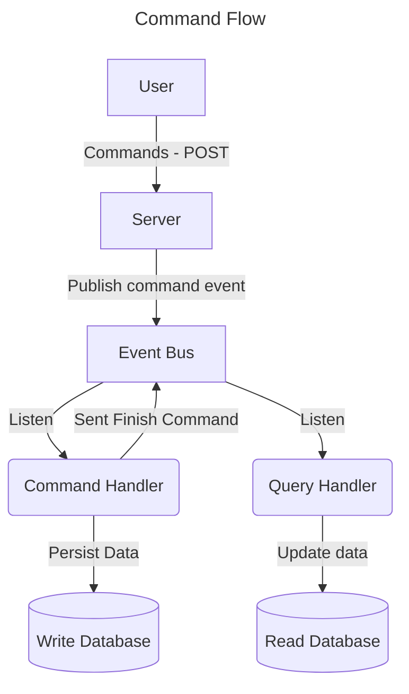
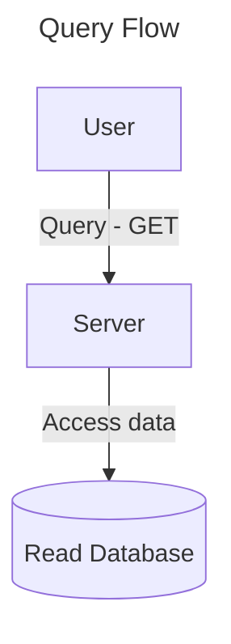

## CQRS Flow

```mermaid
---
title: Command Flow
---
graph TD
    User --> |Commands - POST| App --> |Publish command event| Queue
    
    Queue --> |Listen| CommandHandler --> |Persist Data| WriteDb
    CommandHandler --> |Sent Finish Command| Queue

    Queue --> |Listen| QueryHandler --> |Update data| ReadDb

    User[User]
    App[Server]
    CommandHandler(Command Handler)
    QueryHandler(Query Handler)
    ReadDb[(Read Database)]
    WriteDb[(Write Database)]
    Queue["Event Bus"]
```

```mermaid
---
title: Query Flow
---
graph TD
    User --> |Query - GET| App --> |Access data| ReadDb
    
    User[User]
    App[Server]
    ReadDb[(Read Database)]
```

### References
- https://viniciuscampitelli.com/slides-comunicacao-microsservicos/#/9/20
- https://www.youtube.com/watch?v=Q4meQZHIs1c
