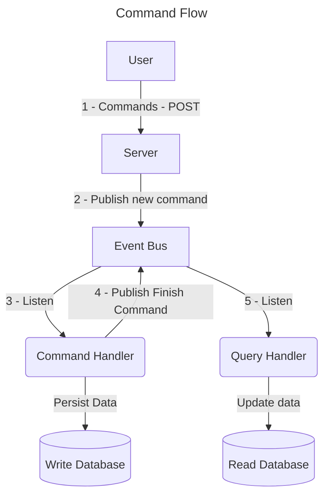
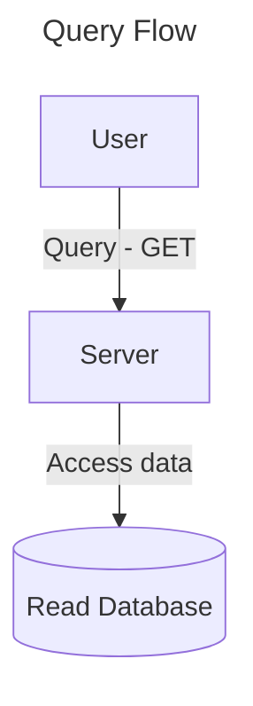

## CQRS Flow

### References
- https://viniciuscampitelli.com/slides-comunicacao-microsservicos/#/9/20
- https://www.youtube.com/watch?v=Q4meQZHIs1c
- https://www.eventstore.com/blog/event-sourcing-and-cqrs
- https://speakerdeck.com/khaosdoctor/controlando-o-tempo-com-typescript-e-event-sourcing
